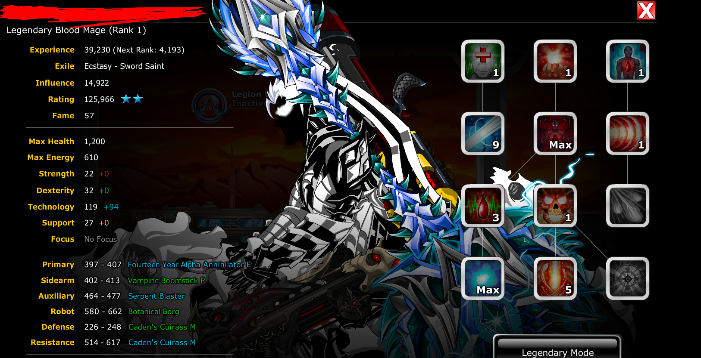
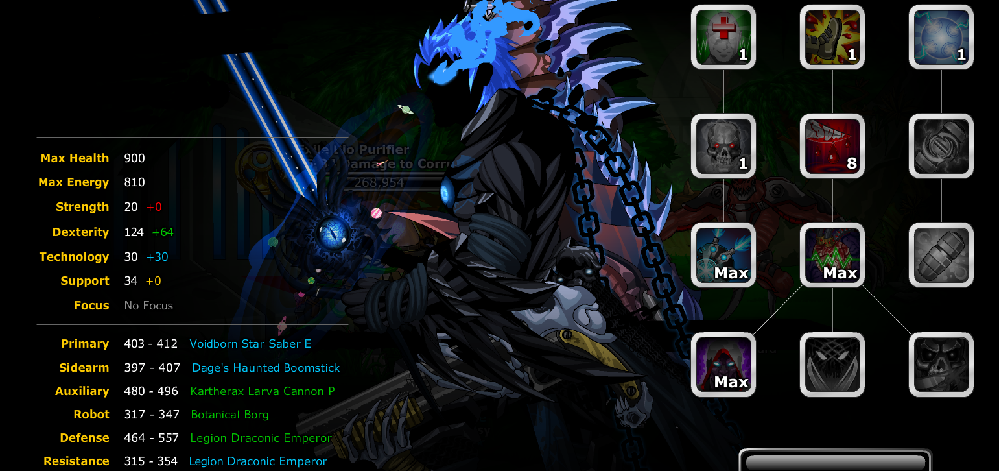

# EpicDuel Bot
This bot was built by me to farm NPC Juggernaut battles as it can be a chore to grind from Legendary Level 1 to 100.
## Requirements
This program requires the following to run:
- Latest Version of Python from [here](https://www.python.org/)
- PyAutoGui package
- Keyboard package
- Python-Opencv
- The latter three can be installed by running the following command after cloning the repo:
```pip install -r requirements.txt```

## Guide to use
- EpicDuel settings: Best graphics, Language: English, War Notifs + Leaderboard Updates OFF, Fastest Performance (Slider all the way right). Low Performance ones are up to you.
The bot lets you customize your own build. I have provided two builds that I felt work well juggernaut format. The first build bmFullTech should be used until LR10, upon which you should switch to bhFullDex after allocating points into NPC Armor. To switch your build, edit the code in main.py under the comment "edit build here".


- Overall, just clone the repo and then run main.py
- Make sure you are in the main directory when running the code, else the program will not be able to find the image files.
- Epic Duel must be maximized on your primary monitor, and it should be 1920x1080.
- If the bot goes haywire and you lose control of your mouse, you can either move the mouse to a corner of your screen or press CTRL + ALT + DELETE.


## Other notes
Feel free to add or change things to the bot, I can merge your pull requests if you feel like it's a good improvement.
