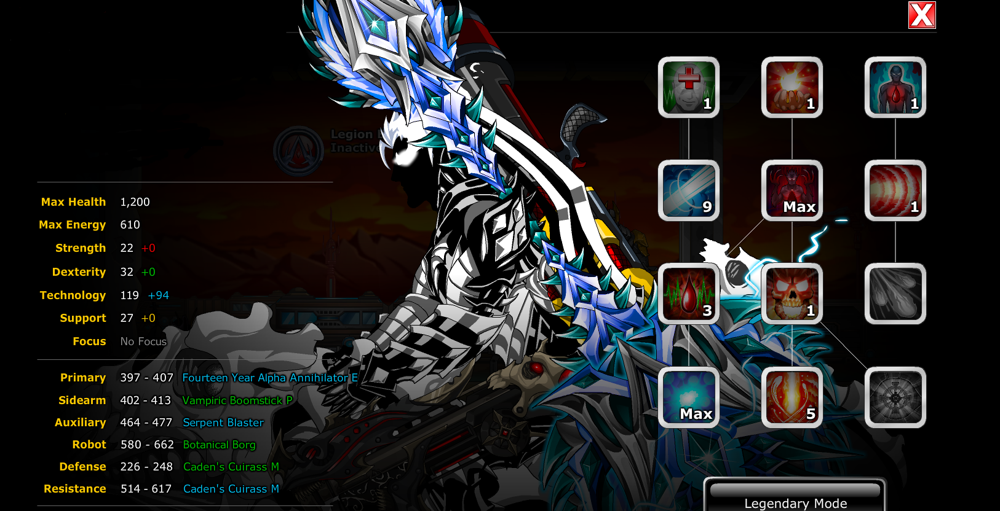

# EpicDuel Bot
This bot was built by me to farm NPC Juggernaut battles as it can be a chore to grind from Legendary Level 1 to 100.
## Requirements
This program requires the following to run:
- Latest Version of Python from [here](https://www.python.org/)
- PyAutoGui package
- Keyboard package
The latter two can be installed by running the following command after cloning the repo:
```pip install -r requirements.txt```

## Guide to use
This build assumes you're going to be running the following build:

- There are better, more optimized builds out there but I felt that this worked the best with the randomness of the bot's image recognition.
- Overall, just clone the repo and then run main.py
- If the bot goes haywire and you lose control of your mouse, you can do Ctrl + Alt + Delete to activate failsafe and regain control of your PC.
- Epic Duel must be fullscreen on your primary window, and it should be 1920x1080.

## Other notes
Feel free to add or change things to the bot, I can merge your pull requests if you feel like it's a good improvement.
